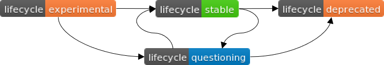

# R Function Badges

#### CFgO badges for R functions 

This page describes the typical lifecycle of R functions at CFgO. Knowing where a function is in its lifecycle is particularly important for understanding how the function will change over time.

#### Experimental 

An experimental function is in the very early stages of development. The function will be changing frequently as we rapidly iterate and explore variations in search of the best fit. Experimental functions are set up quickly without finished testing and documenting frameworks.

Every R function starts with the experimental badge. Functions marked as experimental lack of documentation, example cases, unit tests or all of those. Thus, using such functions in reports and shiny apps should be avoided!

#### Stable 

In a stable function, we are largely happy and major changes are unlikely. This means that the function will generally evolve by adding new features and new arguments; we will avoid removing arguments or changing the meaning of existing arguments.

Conditions for functions marked as stable:

* Function in master branch
* Minimum testing framework set up and applied succesfully
* `roxygen2` function descriptions readable and understandable for anyone who did not programm the function
* At least one example applied to each function
* Example and testing results in 100% Code coverage checked by `covr`
* No future changes to the core of the function are expected - the function is ready for use in other packages

#### Deprected 

If breaking changes are needed, they will occur gradually. To begin with, the function will be deprecated; it will continue to work but will emit an message informing you of the change. Next, typically after approx. 2 months, the message will be transformed to an error. Once all applications are checked and still work, the function will be removed.

Along with badge, add `rlang::message()` to the function to remind all users of this function of the future remove. 

#### Questioning 

Functions which contain bugs, serve questionable purposes, contain slow / unexpected / unneccesarily complex code fragments or generate any further kind of unexpected behaviour.

Add a section `Questioning` at the end of the respective function. Use this to explain why the function in its current form is questioned. Additionaly, add an `rlang::warning()` to the function, generate a `GitHub Issue` and link to GitHub to call attention to this issue.

